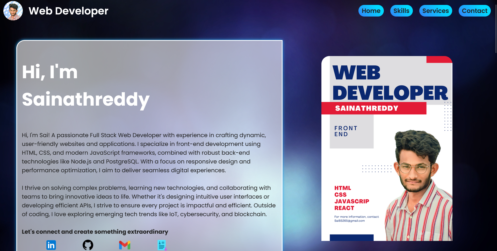

# Portfolio Website

A modern, responsive portfolio website showcasing my skills, services, and contact information.




##  [🔗 View Live Site](https://sainath-666.github.io/Portfolio_2/)

## ✨ Features

- Fully responsive design that works on all devices
- Modern UI with smooth animations
- Sections for skills, services, and contact form
- Video background for visual appeal

## 💻 Technologies Used

- HTML5
- CSS3 (with media queries for responsiveness)
- Google Fonts
- Font Awesome icons

## 📱 Responsive Design

The site is fully responsive and optimized for:
- Desktop displays
- Tablets
- Mobile phones

## 🚀 Quick Start

1. Clone the repository:
   ```bash
   git clone https://github.com/sainath-666/Portfolio_2.git
   ```
2. Open `index.html` in your browser

## 📧 Contact

Feel free to reach out if you have any questions or suggestions!


## 🔗 Connect With Me

- [GitHub](https://github.com/sainath-666)
- [LinkedIn](https://www.linkedin.com/in/sainath666)

---

<div align="center">
  <p>Made with ❤️ by Your Sainathreddy</p>
</div>

